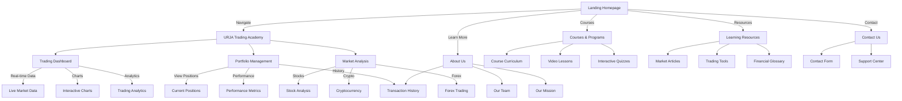

```mermaid
flowchart TD
    Landing[Landing Homepage] -->|Navigate| Trading[URJA Trading Academy]
    Landing -->|Learn More| About[About Us]
    Landing -->|Courses| Courses[Courses & Programs]
    Landing -->|Resources| Resources[Learning Resources]
    Landing -->|Contact| Contact[Contact Us]
    
    Trading --> Dashboard[Trading Dashboard]
    Trading --> Portfolio[Portfolio Management]
    Trading --> Markets[Market Analysis]
    
    About --> Team[Our Team]
    About --> Mission[Our Mission]
    About --> History[Our History]
    
    Courses --> Curriculum[Course Curriculum]
    Courses --> Lessons[Video Lessons]
    Courses --> Quizzes[Interactive Quizzes]
    
    Resources --> Articles[Market Articles]
    Resources --> Tools[Trading Tools]
    Resources --> Glossary[Financial Glossary]
    
    Contact --> Form[Contact Form]
    Contact --> Support[Support Center]
    
    Dashboard -->|Real-time Data| Live[Live Market Data]
    Dashboard -->|Charts| Charts[Interactive Charts]
    Dashboard -->|Analytics| Analytics[Trading Analytics]
    
    Portfolio -->|View Positions| Positions[Current Positions]
    Portfolio -->|History| History[Transaction History]
    Portfolio -->|Performance| Performance[Performance Metrics]
    
    Markets -->|Stocks| Stocks[Stock Analysis]
    Markets -->|Crypto| Crypto[Cryptocurrency]
    Markets -->|Forex| Forex[Forex Trading]
```